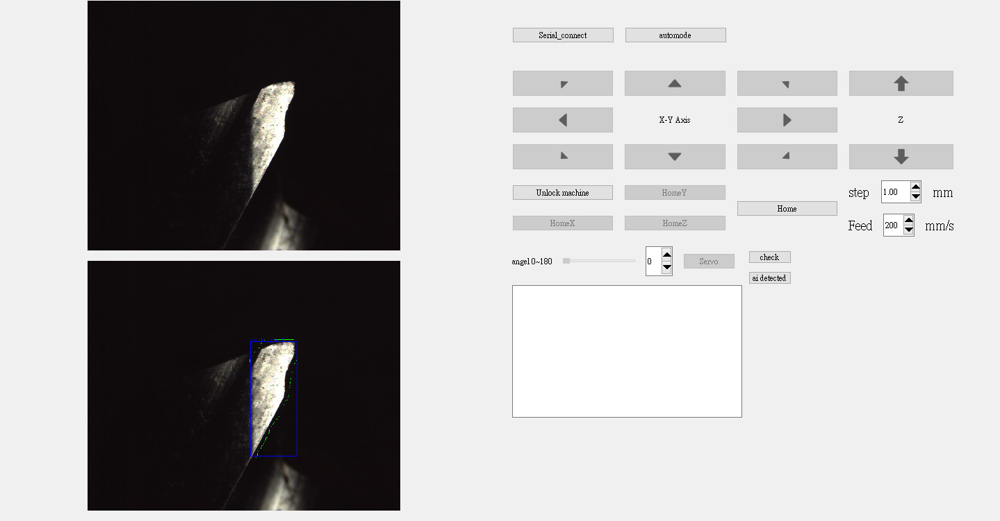
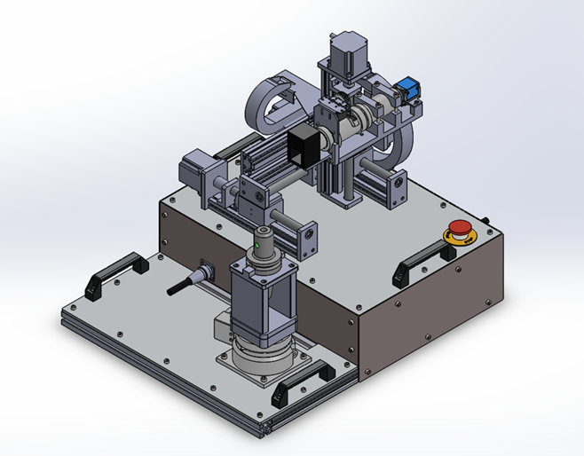

# PAOM
PyQt5 with Automatic optical microscope 

## Description

PAOM is a set of software for variable magnification camera with XYZ stage and rotary stage for object detection, 
the control can use G-code Command to give commands, the current specification is reprap ramps1.4 with marlin, 
and it can also be used with AI for object detection,
as shown in the picture below can be identified The location to be recognized

## Hardware Specification

- Arduino mega2560
- reprap ramps1.4
- stepper motor
- High precision rotary platform
- 1/2' industrial Camera
- MORITEX High Resolution Zoom Lens (0.75x-4.5x)

## Software Highlights

- Pytorch1.6: Run in torchvision mask-rcnn model
- Memory efficient: uses roughly 500mb less GPU memory than classifier image
- CPU Support for inference: run on CPU in inference time.

## installation

check [INSTALL.md](INSTALL.md) for install instructions.

## Attention

This project is still under development, 
if you want to give advice to the development can be through the issure system
